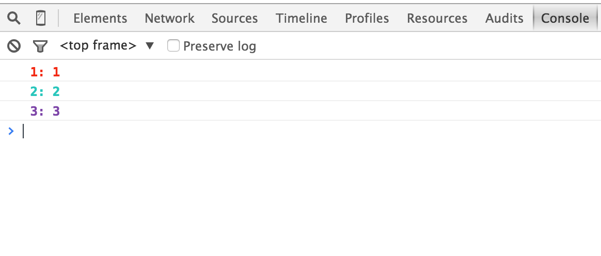

# deb
CommonJS tiny browser debugging utility for your libraries and applications.

You can use it with webpack.

[](https://travis-ci.org/demohi/deb)
[](https://www.npmjs.com/package/deb)
[](https://www.npmjs.com/package/deb)

## Installation

```
$ npm install deb
```

## Usage

```javascript
// add webpack plugin  
plugins: [
  new webpack.DefinePlugin({
    "process.env": {
      DEB: true
    }
  })
],
```

```javascript
var deb = require('deb');
var debug1 = deb('1');
var debug2 = deb('2');
var debug3 = deb('3');
debug1('1');
debug2('2');
debug3('3');
```
## Screenshot



## TODO

*  enable log with space or comma-delimited names
